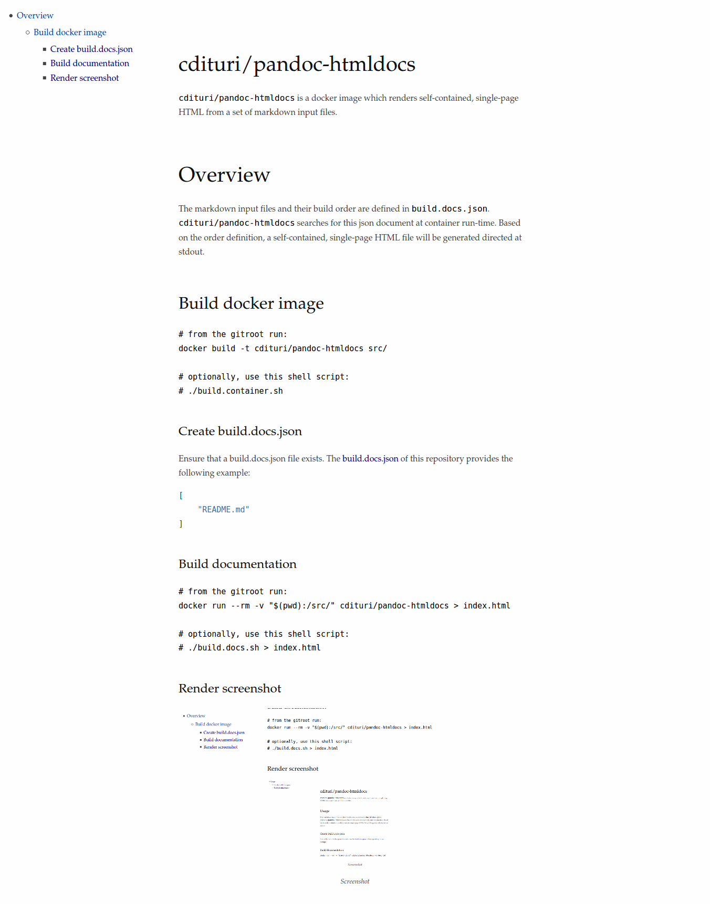

`cdituri/pandoc-htmldocs` is a docker image which renders self-contained,
single-page HTML from a set of markdown input files. The markdown input files
and their build order are defined in `build.docs.json`.


# Overview

`cdituri/pandoc-htmldocs` searches for the `build.docs.json` document at
container run-time. Based on the order definied in the json document, a
self-contained, single-page HTML file is generated, directed to stdout.

## Build docker image

```bash
# from the git repository root, run:
docker build -t cdituri/pandoc-htmldocs src/

# optionally, use this shell script:
# ./build.container.sh
```

### Create build.docs.json

Ensure that a build.docs.json file exists. The [build.docs.json](build.docs.json) of this repository provides the following example:

```json
[
    "README.md"
]
```

### Build documentation

```bash
# from the git repository root, run:
docker run --rm -v "$(pwd):/src/" cdituri/pandoc-htmldocs > index.html

# optionally, use this shell script:
# ./build.docs.sh > index.html
```

### Render screenshot


